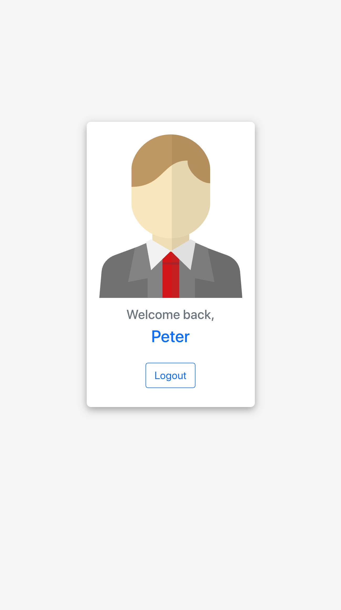

# 帳密檢查機制

[](https://standardjs.com/)

運用資料庫帳號名單比對使用者輸入的電子信箱。若電子郵件與密碼正確，會顯示使用者暱稱的歡迎畫面。

- 電子郵件地址、密碼格式

  - 電子郵件地址：name@domain.name
  - 密碼：不含空白的英文、數字及符號組合至少 8 個字元

- 輸入資料驗證機制

  - 瀏覽器表單驗證
  - 前端驗證格式，提示使用者、自動校正
  - 後端驗證
    1. 驗證電子郵件格式，傳回錯誤提示
    2. 比對資料庫的帳號資料，傳回歡迎頁面或錯誤提示

- 提升使用者體驗設計
  - 即時操作提示
    - [x] 電子郵件格式正確
    - [x] 輸入密碼包含空白
    - [x] 電子郵件、密碼格式皆符合，啟用登入按鈕
  - 焦點離開輸入框後，處理格式錯誤
    - [x] 顯示錯誤提示
    - [x] 密碼自動去除開頭及結尾空白


 </img>
 </img>
 </img>
 </img>
 </img>
 </img>


## 1.安裝專案資料

1. 將原始碼安裝至指定位置，你可以採取下列其中一種方法
   1. 點選右上方綠色『Code』按鈕，選擇『Download ZIP』下載 ZIP 檔，並解壓縮至專案資料夾中。
   2. 開啟『終端機 Terminal.app』，或在Ｗ indows 開啟『命令提示字元 cmd』

    輸入指令，移動到該專案資料夾位置

    ```text
    cd 「專案資料夾路徑」 (資料夾名稱間的空格要用「 / 」隔開)
    ```

    輸入指令將專案clone至專案資料夾

    ```text
    git clone https://github.com/Pudding1989/Account-Login.git
    ```

2. 安裝伺服器至指定位置
   1. 下載 [MongoDB Community Server](https://www.mongodb.com/try/download/community) （專案使用 for MacOS的 4.2.15 版本），並解壓縮至指定位置，重新命名為「mongodb」
   2. 建立資料庫資料夾，命名為「mongodb-data」
   3. 「mongodb」(資料庫伺服器資料夾)及「mongodb-data」(資料庫資料夾)，可以與專案原始碼資料夾不同位置

## 2.啟動資料庫

### 開啟『終端機 Terminal.app』，或在Ｗindows開啟『命令提示字元 cmd』執行以下指令

1. 移動至伺服器資料夾「mongodb」的下一層執行檔資料夾「bin」

    ```text
    cd 「mongodb(MongoDB Community Server) 資料夾路徑」\bin
    ```

2. 建立種子資料

    ```text
    npm run seed
    ```

   - 指令執行完畢後，終端機會恢復可輸入狀態。  
    如果程式沒有自動結束，終端機顯示 `「播種完畢 <(￣︶￣)>」`訊息後，即可按下 `⌃ (Ctrl) + c` 退出程式
3. 安裝本專案使用的套件

    ```text
    npm install
    ```

4. 輸入執行指令，開啟本地端應用程式伺服器及資料庫伺服器

    ```text
    npm run dev
    ```

   - 當終端機顯示訊息 `NOW, Express is start listening on http://localhost:3000` ，表示已成功開啟應用程式伺服器
   - 當終端機顯示訊息 `MongoDB Connected  ｡:.ﾟヽ(*´∀)ﾉﾟ.:｡`，表示已成功連線至資料庫伺服器

5. 於瀏覽器開啟網站

    ```text
    http://localhost:3000/
    ```

6. 記得在終端機按下 `⌃ (Ctrl) + c` 或是在命令提示字元 `ctrl + c` ，關閉本應用程式伺服器及資料庫伺服器

## 開發工具版本

後端框架

- Node.js: 14.16.0  

後端套件

- Node Express: 4.17.1

資料庫

- Mongoose: 5.13.8

模板引擎

- Express Handlebars: 5.3.3

前端框架

- Bootstrap: 5.1.3

  Bootstrap JavaScript plugin
  - Popper: 2.10.2 min UMD build  

Coding Style 檢查套件

- JavaScript Standard Style: 16.0.3
